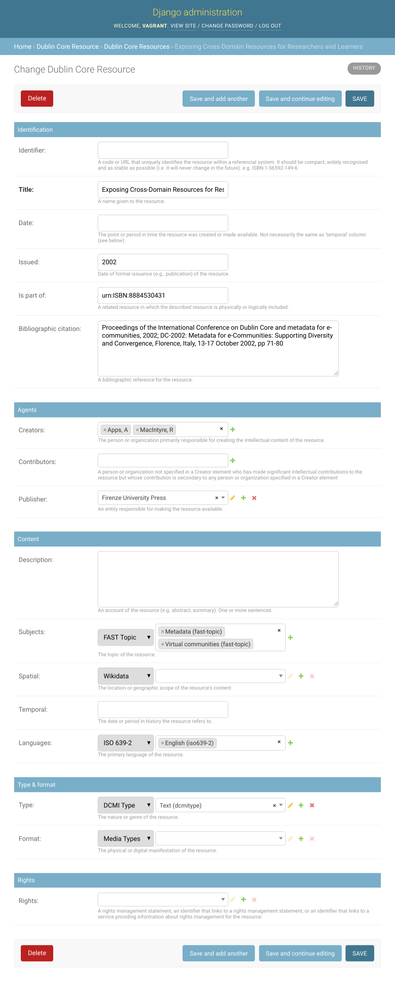

# Django Dublin Core Resource

A Django model and admin interface to manage metadata about your resources
using [standard Dublin Core (DC) schema](https://www.dublincore.org/specifications/dublin-core/dcmi-terms/).

The approach taken by this app is to centralise all your resource metadata
into a single table.

<p align="center">
  
</p>

# Data Models

* AbstractDublinCoreResource
  * an abstract Django Model that replicate the Dublin Core schema
  * each [DC element](https://www.dublincore.org/specifications/dublin-core/dcmi-terms/#section-3) (dc:) is represented by a field
  * some [DC terms](https://www.dublincore.org/specifications/dublin-core/dcmi-terms/#section-2) (dcterms:) are also included
  * makes use of ControlledTermField for links to controlled vocabularies
* DublinCoreResource
  * inherit from AbstractDublinCoreResource
* DublinCoreAgent
  * represents a person or organisation
* DublinCoreRights
  * represents Rights statements that can be shared among your resources

# Features

* One centralised table for all your resource
* Standard Dublin Core elements/fields
* Lookup values into authority lists / controlled vocabularies
* Inline description of all fields
* Extensible model
* [TODO] smart bulk import/update from CSV
* [TODO] advanced input validations
* [TODO] API / export into various standard formats
* [TODO] support for file attachment / upload
* [TODO] support for bibliographic citation parsing / extraction
* [TODO] support for [EDTF dates](https://pypi.org/project/edtf/)
* [TODO] use CC schema for the rights

# Set up

## Installation

```
pip install django-dublincore-resource
```

```
./manage.py migrate
```

## Configuration

The following settings vars are defined by default but can be overridden
in your Django settings.py.

By default this app provides a DublinCoreResource model that inherit
from the abstract AbstractDublinCoreResource model. Set the following to
False to define your own model.

```
# Set to True to disable the DublinCoreResource model and define your own
DUBLINCORE_RESOURCE_ABSTRACT_ONLY = False
```

```
# The path where resource file are uploaded, relative to your MEDIA path
DUBLINCORE_RESOURCE_UPLOAD_PATH = 'uploads/dublin_core/'
```
